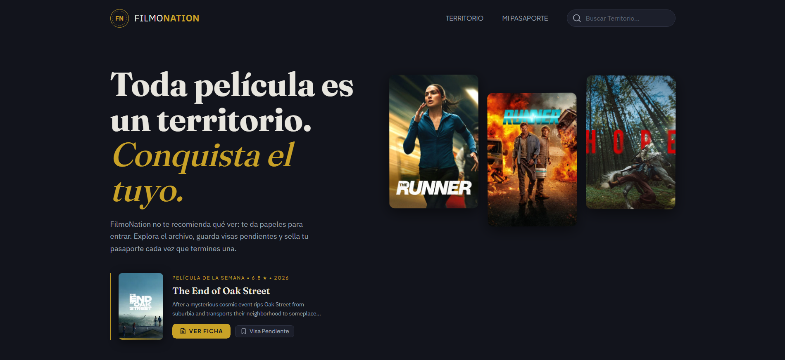

# 🎬 FilmoNation

[](https://filmonation.vercel.app/)
&nbsp;&nbsp;[**🚀 Ver Aplicación**](https://filmonation.vercel.app/)



Plataforma de grado profesional diseñada para explorar, gestionar y sellar tu pasaporte cinematográfico mediante una arquitectura escalable, accesible e internacionalizada.

## 🏛 Arquitectura y Stack Tecnológico

El proyecto está diseñado bajo los principios de **Clean Architecture**, asegurando una separación estricta de responsabilidades en tres capas principales:

- `domain/`: Modelos de datos y entidades nucleares independientes del framework.
- `infrastructure/`: Implementaciones concretas como la integración con la API de TMDB (`api/`) y adaptadores de almacenamiento (`storage/`).
- `presentation/`: Lógica de interfaz gráfica, componentes UI, páginas y hooks personalizados de React.

**Ecosistema de Herramientas:**

- **Core:** React 19 + TypeScript (Strict Mode)
- **Estilos:** Tailwind CSS v4 (Arquitectura basada en tokens, variables HSL, _glassmorphism_ y microinteracciones)
- **Estado Asíncrono:** TanStack Query v5 (Caché inteligente y sincronización en segundo plano)
- **Enrutamiento:** React Router v7 (Navegación tipo SPA con layouts anidados)
- **Formularios:** React Hook Form (Gestión eficiente de estados y validaciones sin re-renderizados innecesarios)

---

## 🚀 Guía de Instalación y Scripts de Entorno

### Paso a Paso Reproducible

Para clonar, configurar y ejecutar el proyecto de forma autónoma, sigue estas instrucciones precisas:

1. **Clonar el repositorio**

   ```bash
   git clone https://github.com/tu-usuario/filmonation.git
   cd filmonation
   ```

2. **Instalar dependencias**  
   Utilizamos `pnpm` para garantizar instalaciones rápidas y deterministas.

   ```bash
   pnpm install
   ```

3. **Configurar variables de entorno**  
   Crea un archivo `.env` en la raíz del proyecto basándote en el ejemplo proporcionado (si existe) y añade tu clave de acceso a la API de TMDB:

   ```env
   VITE_TMDB_API_KEY=tu_api_key_aqui
   VITE_TMDB_API_URL=https://api.themoviedb.org/3
   ```

4. **Puesta en marcha del servidor local**
   ```bash
   pnpm run dev
   ```
   El proyecto estará disponible en `http://localhost:5173`.

### Comandos de Validación

| Comando                | Descripción                                                                                                 |
| :--------------------- | :---------------------------------------------------------------------------------------------------------- |
| `pnpm run dev`         | Inicia el servidor de desarrollo local con Hot Module Replacement (HMR).                                    |
| `pnpm build`           | Transpila y empaqueta la aplicación para producción de forma optimizada.                                    |
| `pnpm run check-types` | Ejecuta la verificación estática de tipos de TypeScript sin emitir archivos (`tsc --noEmit`).               |
| `pnpm run lint`        | Ejecuta el análisis estático de código para garantizar los más altos estándares y ausencia de advertencias. |

---

## ♿ Compromiso de Accesibilidad e Internacionalización (A11y & i18n)

FilmoNation prioriza la inclusión, asegurando experiencias equitativas para todos los usuarios:

- **Accesibilidad (WCAG):**
  - Gestión de foco automatizada a través de `RouteFocusManager` en los cambios de ruta.
  - Navegación semántica: Nombres accesibles completos (ej. en `MovieCard`) integrados con atributos `aria-label`, `aria-hidden` y control de tabulación.
  - Soporte completo para navegación por teclado, evitando trampas de foco.
- **Internacionalización (i18n):**
  - Formateo cultural estricto utilizando la API nativa `Intl` del navegador para fechas, números y monedas.
  - Catálogo de textos centralizado en `messages.ts` (diccionario único) para facilitar la escalabilidad y futuras traducciones.

---

## 📽 Atribución Oficial a TMDB

Este producto utiliza la API de TMDB pero no está avalado ni certificado por TMDB (The Movie Database).  
Toda la información sobre películas, imágenes y logotipos asociados son propiedad intelectual de TMDB y sus respectivos dueños.

<a href="https://www.themoviedb.org/" target="_blank">
  
</a>
